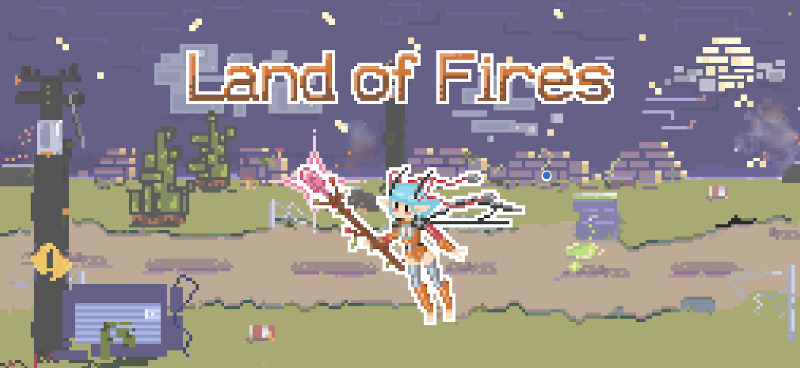

#### In the polluted Land of Fires, a mysterious mechanical fairy is fighting toxic waste with her purifying magic to defend nature.

Land of Fires, an arcade shoot 'em up game featuring gloomy, yet sharply animated pixel art, was developed in the span of eleven days by a team of five, using the SpriteKit framework.

_________________

##### Github: https://github.com/acacciola22/LandOfFires  

_________________

##### Team:
**[Alina Brandizzi](https://www.behance.net/roaringspark)** - pixel art, 2d animations, HUD & fairy design  
**Antonia Cacciola** - coding  
**Ester Piscopo** - pixel art, 2d animations, HUD, stage & enemy design  
**Gianmarco Gargiulo** - coding, sfx, pixel art  
**Rita Marrano** - coding  
